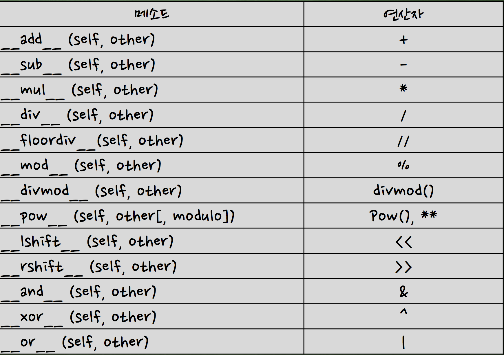
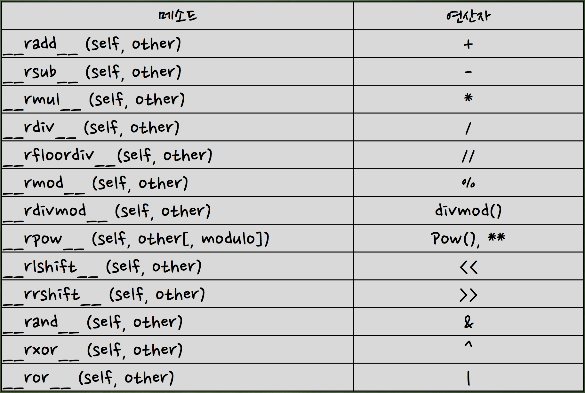

Python week01 - class
=====================
1. 파이썬 클래스 형태 
2. 메소드 호출
3. 클래스/인스턴스 멤버 
4. 생성자/소멸자
5. 연산자 오버로딩 
6. 다양한 메소드 
7. 상속
8. 다중상속
9. 다형성 
10. 캡슐화
---
---
#Class
    class 클래스이름 (상속클래스)명 :
        def 클래스함수( self, [인수들...]):
        ...

- self : namespace 클래스객체 / 인스턴스 객체의 이름공간이 다르다, self는 현제 인스턴스의 객체를 가리키는 것, 이를 통해 인스턴스 객체의 이름공간에 접근하는 것

- Naming Mangling
    - _ : protected
    - __ : private

- static method : 정적 메소드 인스턴스 객체 없이 클래스에서 직접 호출 가능
	- static method  
- class method
    - classmethod
    
- 생성자 & 소멸자 : 
    - def __init__(self): # 생성자
    - def __del__(self): # 소멸자
    
- 연산자오버로딩
 
 
    
    - __coerce__ #자료형을 조정해 줌
        def __coerce__(self, y): 
            return self.n, y
            
- property / @property

```{.python}
__author__ = '1002475'

class Test(object):

    # !!!! setter/getter !!!!
    def __init__(self):
        self.__degree = 0

    def get_degree(self): #degree getter
        return self.__degree

    def set_degree(self, d): # degree setter
        self.__degree = d % 360

    degree = property(get_degree, set_degree)

    __slots__= ['name', 'phone', '__degree']

    def __call__(self):
        print "call called"

test2 = Test()
test2.degree = 10
print test2.degree
test2.degree = 350
print test2.degree
```

```{.python}
@property 예제

class Silly:

    @property
    def silly(self):
        print("You are getting silly")
        return self._silly

    @silly.setter
    def silly(self, value):
        print("You are making silly {}".format(value))
        self._silly = value

    @silly.deleter
    def silly(self):
        print("Whoa, you killed silly!")
        del self._silly

mySilly = Silly()

mySilly.silly = "I'm calling getter"
print(mySilly.silly)
```

- 상속
	- issubclass()